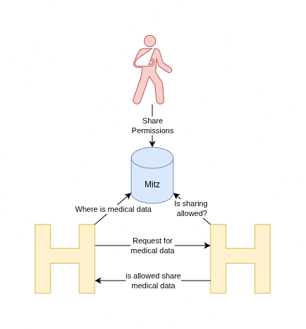

# Microservices & Containerisation met .NET Aspire
 
---


# Rick Neeft

## Developer @VECOZO

<i class="bi bi-linkedin"></i> LinkedIn: [rneeft](https://linkedin.com/in/rneeft)
<i class="bi bi-browser-chrome"></i> Blog: [rickneeft.dev](https://www.rickneeft.dev)
<i class="bi bi-github"></i> GitHub: [rneeft](https://github.com/rneeft)

---


---

# Agenda

- Gymnastics
- Theory
- Introduction
- Case
- Give it a go
- .NET Aspire
- Identity Provider
- Messaging

---

# Gymnastics
- Who is using Windows

---

# Gymnastics
- Windows User: Who knows what WSL is?

---

# Gymnastics
- Who is using Linux

---

# Gymnastics
- Who is using MacOS

---

# Gymnastics
- Who is using dotnet for programming?

---

# Gymnastics
- Who is using Java for programming?

---

# Gymnastics
- Who is using something else for programming?

---

# Gymnastics
- Who knows what Docker is?

---

# Gymnastics
- Who knows what Virtual machines are?


---

# Microservices & Containerisation met .NET Aspire

### From Monoliths to Modern Deployment

The theory, just a little bit, I promise

---

# In the early days: Monoliths


**What is a monolith?**

- Single, unified codebase
- All components tightly coupled

**Challenges:**
- Difficult to scale specific parts
- Risky deployments (entire app goes down)
- Long development and release cycles

<sub><sup><sup><sup>Image from 2001: A Space Odyssey</sup></sup></sup></sub>

---

# The Rise of Microservices


**Why Microservices?**
- Decouple components for flexibility
- Faster independent deployments
- Technology diversity per service

**Key Principles:**
- Single Responsibility per service
- Communication over APIs or messaging
- Independent scaling

<sub><sup><sup><sup>Photo by Wolfgang Weiser: https://www.pexels.com/photo/container-ships-at-busy-hamburg-port-31637364/</sup></sup></sup></sub>

---

# Deploying Microservices

**Key Features:**
- Each service is deployed **independently**
- Uses **containers** (e.g., Docker)
- Orchestrated by platforms like **Kubernetes**
- Updates via **CI/CD pipelines**

**Common Stack:**
- Docker → Package
- Kubernetes → Deploy & Scale
- CI/CD → Automate release (e.g., GitHub Actions, GitLab, Jenkins)

---

# What will we do today

- Docker (compose) deployment
- Use .NET Aspire

---

# Docker


- Platform for developing, shipping and running application
- Package with loosely isolated environments: containers
- Containers are 'lightweight' and portable.

---
# How? Dockerfile

- Like a Recipe
- Describes how to build an docker image
- Docker image: read-only instructions to create the container

---

# Dockerfile - Example
```dockerfile
FROM mcr.microsoft.com/dotnet/aspnet:10.0 AS base
WORKDIR /app
EXPOSE 8080

FROM mcr.microsoft.com/dotnet/sdk:10.0 AS build
WORKDIR /src

COPY ["src/Data/Data.csproj", "src/Data/"]
COPY ["src/DossierApi/DossierApi.csproj", "src/DossierApi/"]
COPY NuGet.config .
RUN dotnet restore "src/DossierApi/DossierApi.csproj"

COPY src/Data/ src/Data/
COPY src/DossierApi/ src/DossierApi/
RUN dotnet publish "src/DossierApi/DossierApi.csproj" -c Release -o /app/publish --no-restore

FROM base AS final
WORKDIR /app
COPY --from=build /app/publish .
ENTRYPOINT ["dotnet", "DossierApi.dll"]
```

---
# Docker compose

- If the **dockerfile** is a recipe then **Compose** is your menu

---

# Docker compose - Example

```yml
services:
  sqlserver:
    image: mcr.microsoft.com/mssql/server:2022-latest
    environment:
      SA_PASSWORD: ${SQL_PASSWORD}
      ACCEPT_EULA: "Y"
      MSSQL_PID: Express
    ports:
      - "2026:1433"
    volumes:
      - sqldata:/var/opt/mssql
    healthcheck:
      test: /opt/mssql-tools18/bin/sqlcmd -S localhost -U sa -P "$$SA_PASSWORD" -Q "SELECT 1" -No
      interval: 10s
      timeout: 5s
      retries: 10
      start_period: 30s
```

---

# Theory - Questions?
---

# I work on

## OTV (Mitz)

---

# Online toestemming -> Mitz

Health provider have data about a patient

- GP -> Medical Data
- Pharmist -> Medication data
- Hospitals -> Lab results

Who is allowed to share this data with whom??


---



---

# Questions?
So far

---

# Lets go!!

```
https://aspire.rickneeft.dev/
```

```
https://github.com/rneeft/workshop-avans-3-juni
```
